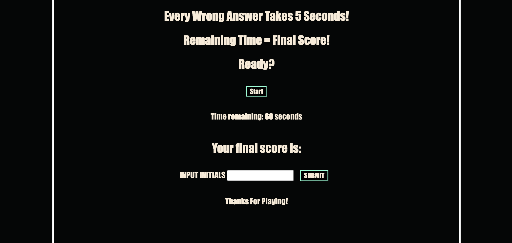

# CODE QUIZ
## Description

This is a timed coding quiz to help myself and other developers retain our knowledge from throughout the course.

### User Story
```
AS A coding boot camp student
I WANT to take a timed quiz on JavaScript fundamentals that stores high scores
SO THAT I can gauge my progress compared to my peers
```
### Acceptance Criteria
```
GIVEN I am taking a code quiz
WHEN I click the start button
THEN a timer starts and I am presented with a question
WHEN I answer a question
THEN I am presented with another question
WHEN I answer a question incorrectly
THEN time is subtracted from the clock
WHEN all questions are answered or the timer reaches 0
THEN the game is over
WHEN the game is over
THEN I can save my initials and score
```

## Installation
No Install Needed. You can access the webpage through the link below.

https://jbxamora.github.io/codeyquiztime/



## Code Snippets

### Local Storage

```js
function storeHighscore(initials) {
    highscores.push({
        initials,
        score: mainTimer,
    });
    highscores.sort((a, b) => b.score - a.score);
    localStorage.setItem("highscores", JSON.stringify(highscores));

```


### Check Accuracy


```js
function ChoiceMade(target) {
    if (questionCount === questionBank.length) {
        endQuiz();
        return;
    }
    checkAccuracy(target);
    incrementQuestion();
    var toastInterval = setInterval(function () {
        decision.textContent = "";
        clearInterval(toastInterval);
    }, 1000)
}
// Checks wether or not the answer is correct according to tthe questionBank
function checkAccuracy(target) {
    // var = correctAnswer = questionBank[questionCount].correctAnswer;
    if (target.textContent === questionBank[questionCount].answerChoices[correctAnswer]) {
        decision.textContent = decision.getAttribute("data-correct");
    } else {
        decision.textContent = decision.getAttribute("data-wrong");
        mainTimer -= 5;
    }
}

```

## License

MIT License

Copyright (c) [2022] [Jorge Zamora]

Permission is hereby granted, free of charge, to any person obtaining a copy
of this software and associated documentation files (the "Software"), to deal
in the Software without restriction, including without limitation the rights
to use, copy, modify, merge, publish, distribute, sublicense, and/or sell
copies of the Software, and to permit persons to whom the Software is
furnished to do so, subject to the following conditions:

The above copyright notice and this permission notice shall be included in all
copies or substantial portions of the Software.

THE SOFTWARE IS PROVIDED "AS IS", WITHOUT WARRANTY OF ANY KIND, EXPRESS OR
IMPLIED, INCLUDING BUT NOT LIMITED TO THE WARRANTIES OF MERCHANTABILITY,
FITNESS FOR A PARTICULAR PURPOSE AND NONINFRINGEMENT. IN NO EVENT SHALL THE
AUTHORS OR COPYRIGHT HOLDERS BE LIABLE FOR ANY CLAIM, DAMAGES OR OTHER
LIABILITY, WHETHER IN AN ACTION OF CONTRACT, TORT OR OTHERWISE, ARISING FROM,
OUT OF OR IN CONNECTION WITH THE SOFTWARE OR THE USE OR OTHER DEALINGS IN THE
SOFTWARE.

## Badges

<a href=”https://www.linkedin.com/in/jorge-zamora-786945250/”>


## Contributing

Pull requests are welcome. For major changes, please open an issue first to discuss what you would like to change. If the issue goes unresolved for more than a week feel free to contact me at any of the links listed below. Be sure to add me on LinkedIn and Follow me on GitHub to view my course progression. You can also visit the deployed site and sent a messafe through the contact form.

[](https://github.com/jbxamora)  [](https://www.linkedin.com/in/jorge-zamora-786945250//)  [](https://www.instagram.com/jbxamora/)  [](https://stackoverflow.com/users/20023706/jbxamora)